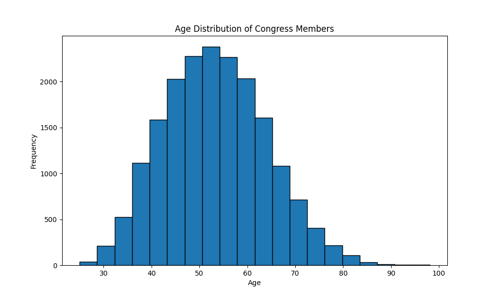
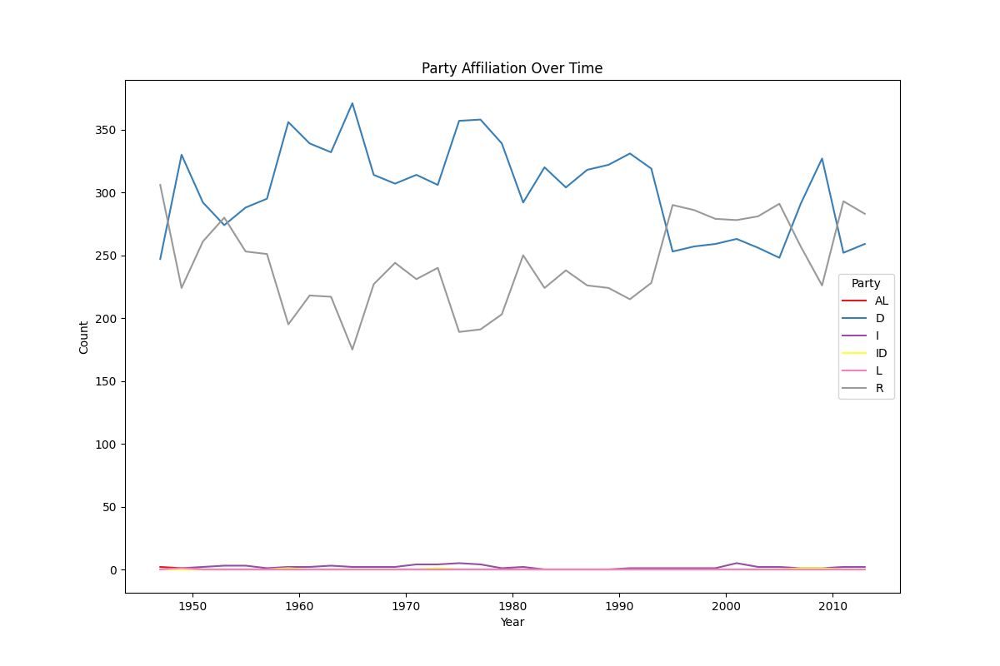
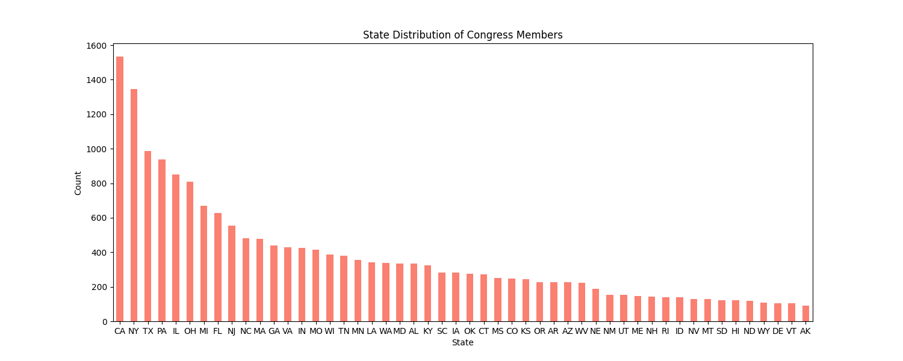

Describe:
|       |    congress |        age |
|:------|------------:|-----------:|
| count | 18635       | 18635      |
| mean  |    96.446   |    53.3137 |
| std   |     9.82343 |    10.6785 |
| min   |    80       |    25      |
| 25%   |    88       |    45.4    |
| 50%   |    96       |    53      |
| 75%   |   105       |    60.55   |
| max   |   113       |    98.1    |

